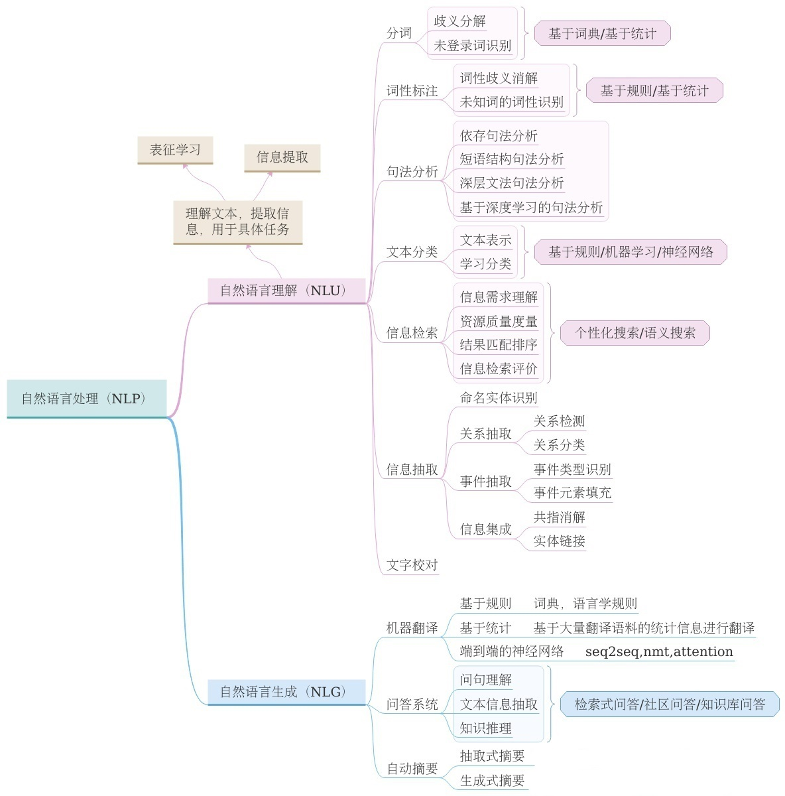
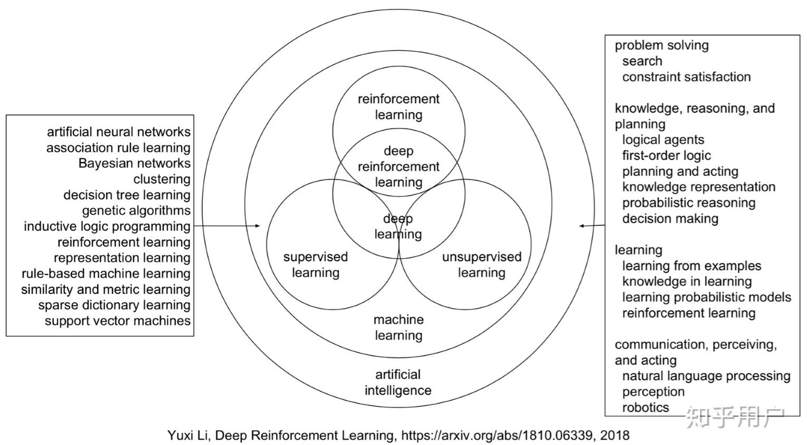

- [概述](#%e6%a6%82%e8%bf%b0)
- [层次](#%e5%b1%82%e6%ac%a1)
- [任务](#%e4%bb%bb%e5%8a%a1)
- [基本技术](#%e5%9f%ba%e6%9c%ac%e6%8a%80%e6%9c%af)
- [发展历程](#%e5%8f%91%e5%b1%95%e5%8e%86%e7%a8%8b)
- [详细说明](#%e8%af%a6%e7%bb%86%e8%af%b4%e6%98%8e)
  - [名词解释](#%e5%90%8d%e8%af%8d%e8%a7%a3%e9%87%8a)

# 概述
NLP里细分领域和技术实在太多，分法也五花八门。各领域之间也不存在明显的界限，往往交叉融合。  
参考[<<自然语言处理>>](https://www.zhihu.com/topic/19560026/intro)

# 层次
- 输入（语音=》语音识别；图像=》光学字符识别）=》文本
- 词法分析 （分词、词性标注、命名实体识别）
- 文本分类/聚类
- 句法分析
- 语义分析/篇章分析

# 任务
- 文本检索
- 机器翻译
- 文本分类
- 情感分析
- 信息抽取
- 序列标注
- 文本摘要
- 问答系统
- 对话系统
- 知识图谱

# 基本技术
- **分词**：基本算是所有NLP任务中最底层的技术。不论解决什么问题，分词永远是第一步
- **词性标注**：判断文本中的词的词性（名词、动词、形容词等等），一般作为额外特征使用
- **句法分析**：分为句法结构分析和依存句法分析两种
- **词干提取**：从单词各种前缀后缀变化、时态变化等变化中还原词干，常见于英文文本处理
- **命名实体识别**：识别并抽取文本中的实体，一般采用BIO形式
- **指代消歧**：文本中的代词，如“他”“这个”等，还原成其所指实体
- **关键词抽取**：提取文本中的关键词，用以表征文本或下游应用
- **词向量与词嵌入**：把单词映射到低维空间中，并保持单词间相互关系不变。是NLP深度学习技术的基础
- **文本生成**：给定特定的文本输入，生成所需要的文本，主要应用于文本摘要、对话系统、机器翻译、问答系统等领域

# 发展历程

1. 按照维基百科的说法，NLP发源于1950年。图灵于该年提出“图灵测试”，用以检验计算机是否真正拥有智能。

2. NLP规则时代  
1950-1970年，模拟人类学习语言的习惯，以语法规则为主流。除了参照乔姆斯基文法规则定义的上下文无关文法规则外，NLP领域几乎毫无建树。

3. NLP统计时代  
70年代开始统计学派盛行，NLP转向统计方法，此时的核心是以具有马尔科夫性质的模型（包括语言模型，隐马尔可夫模型等）。  
2001年，神经语言模型，将神经网络和语言模型相结合，应该是历史上第一次用神经网络得到词嵌入矩阵，是后来所有神经网络词嵌入技术的实践基础。也证明了神经网络建模语言模型的可能性。  
2001年  CRF  
2003年  LDA  
2008年  分布式假设

4. NLP深度时代  
2013年，word2vec  
2013年，CNNs/RNNs/Recursive NN  
2014年，seq2seq  
2015年，attention  
2017年末，Transformer  
2018年末，BERT  
2919年，[2019NLP前沿](https://tech.sina.com.cn/csj/2020-01-07/doc-iihnzahk2530606.shtml)

# 详细说明
## 名词解释

- nlp （Natural Language Processing)  nlu （Natural Language Understanding） nlg （Natural Language Generation）
  

- 序列标注：序列标注问题包括自然语言处理中的分词，词性标注，命名实体识别，关键词抽取，词义角色标注等等。我们只要在做序列标注时给定特定的标签集合，就可以进行序列标注。

- 机器学习： 广义上来说，机器学习是一种能够赋予机器学习的能力以此让它完成直接编程无法完成的功能的方法。但从实践的意义上来说，机器学习是一种通过利用数据，训练出模型，然后使用模型预测的一种方法。
  

机器学习三要素

- 模型：模型定义了解空间。在监督学习中，模型就是要学习的条件概率分布或者决策函数。
- 算法：算法指学习模型的具体计算方法。通常采用数值计算的方法求解。
- 策略：策略考虑的是按照什么样的准则学习，从而定义优化目标。
